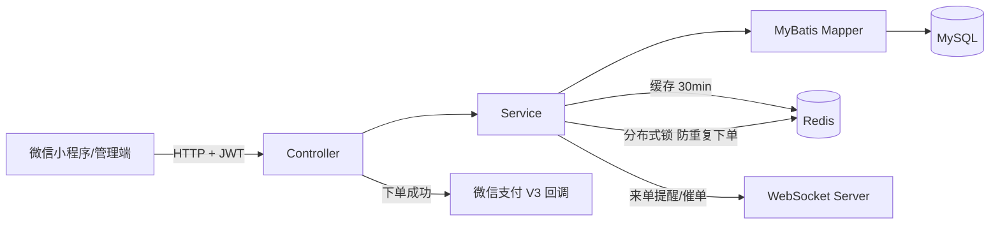

# 苍穹外卖（Sky Take-out）—— 个人优化版

> 基于 **B 站黑马程序员《苍穹外卖》** 课程项目（Spring Boot 单体应用）二次开发与深度优化。
> 在保留原有业务功能（管理端 + 用户端 + 小程序）完整可用的前提下，围绕**安全性、高并发正确性、缓存、代码质量与工程化**进行了系统性改造。

---

## ✨ 项目简介

苍穹外卖是一个包含**管理端**与**用户端（微信小程序）**的在线点餐系统：

- **管理端**：员工/分类/菜品/套餐管理、订单管理、数据统计（图形报表 + Excel 报表）、来单提醒/催单（WebSocket）
- **用户端**：微信登录、商品浏览（缓存加速）、购物车、下单、微信支付、历史订单、地址簿

技术栈：`Java 8`（兼容 17/26） · `Spring Boot 2.7` · `Spring MVC` · `MyBatis` · `MySQL` · `Redis` · `WebSocket` · `JWT` · `微信支付 V3` · `POI` · `Docker`

---

## 🔒 基于原项目的主要优化（含原理与效果）

原项目为黑马程序员课程最终代码，功能完整但存在若干安全性、并发与工程化问题。以下为我做的优化点，**面试常问，标注了原理与可验证效果**：

### 1. 安全加固（消除原有硬伤）

| 优化项 | 原实现问题 | 优化方案 | 效果 |
| --- | --- | --- | --- |
| 密码存储 | 明文/MD5（彩虹表可破解、无盐） | **BCrypt 自适应哈希**（随机盐 + 10 轮迭代）+ 登录时对历史 MD5 密码**静默渐进迁移**（校验通过后自动升级为 BCrypt） | 抗彩虹表/撞库攻击；存量账号无需强制改密 |
| JWT 密钥 | 硬编码在配置文件中（`itcast`/`itheima`） | 移入环境变量 `SKY_JWT_ADMIN_SECRET` / `SKY_JWT_USER_SECRET`（Docker Compose 注入，HS256 强制 ≥32 字节） | 密钥不再入库/入仓库，换环境即可换密 |
| 有漏洞依赖 | fastjson 1.2.76（反序列化 RCE）、12207&POI 3.16（XXE）、commons-lang 2.x、jjwt 0.9.1 | **fastjson → Jackson**（Spring 默认，零新增依赖）；POI → 5.2.5；commons-lang → lang3；jjwt → 0.11.5 | 消除已知 CVE 面 |
| 宽松配置 | `spring.main.allow-circular-references: true` 掩盖了 pagehelper 自循环 Bug | 升级 **pagehelper 1.4.7** 根治循环依赖并移除该配置 | 启动配置回归默认严格模式 |

### 2. 高并发正确性（核心亮点）

- **订单号：雪花算法**（`System.currentTimeMillis()` → 64 位 Snowflake）
  - 原实现并发下必重复、可被猜测（13 位时间戳）
  - 现实现：`1bit + 41bit 时间戳 + 5bit 机房 + 5bit 机器 + 12bit 序列`，单实例约 **40 万 ID/秒**，全局唯一、趋势递增；`synchronized` 保证线程安全，含时钟回拨保护（≤5ms 等待追平）
  - 效果：单测覆盖 100 线程 × 2000 ID 并发无重复
- **防重复下单：Redis 分布式锁**（自定义 `RedisLock`）
  - 原实现用户连点"提交订单"会生成多个订单
  - 现实现：`SETNX + 过期时间` 原子占位（避免死锁）；锁值用 UUID，释放走 **Lua 脚本"比对后删除"**（防止误删他人锁）；以 userId 为粒度，锁在事务外获取、finally 释放
  - 效果：同一用户并发提交只有一个请求能进入下单流程（有单测验证）

### 3. 缓存改造

- Redis 序列化：默认 JDK 二进制（Redis 内乱码、跨语言不可读）→ **JSON 序列化**（`GenericJackson2JsonRedisSerializer`）
- 缓存使用：Controller 内散落的手写缓存 → **Spring Cache 声明式缓存**（`@Cacheable/@CacheEvict`），菜品/套餐缓存 30 分钟，后台任何改动自动失效
- 效果：缓存逻辑集中、可读、可排查；命中时免 DB 查询

### 4. 代码质量与单元测试

- **构造器注入**（34 个类）：`@Autowired` 字段注入 → `@RequiredArgsConstructor` + `final` 字段，依赖显式、不可变
- 清理死代码：注释残留、无效 import、无效文件
- **17 个单元测试**（JUnit 5 + Mockito）：雪花 ID 并发唯一性、JWT 往返/过期/篡改、登录（BCrypt/密码错/锁定/MD5 迁移）、下单（防重/主流程/异常分支），`mvn test` 全绿
- **修复一个隐藏 Bug**：`Orders.packAmount/tablewareNumber` 为原始类型 `int`，前端不传时 `BeanUtils.copyProperties` 抛 NPE 导致下单 500 → 改包装类型（下单接口偶发崩溃的根因）

### 5. 工程化与部署

- **Maven 构建适配新版 JDK**：显式 `annotationProcessorPaths`（新版 JDK 不再从 classpath 自动发现 Lombok 注解处理器）+ Lombok 升级至 1.18.46，项目可在 **JDK 8 ~ 26** 编译运行
- **阿里云镜像**仓库声明，国内拉取依赖不再超时
- **Docker 容器化**：多阶段 Dockerfile（Maven 构建 + JRE 运行）+ `docker compose up` 一键起 MySQL 8 / Redis 7 / 后端（生产配置 `application-prod.yml` 全环境变量化，JWT 密钥经 Compose 注入）

### 6. 过程性缺陷修复（被整理时发现并修复）

| Bug | 原因 | 修复 |
| --- | --- | --- |
| pagehelper 1.3.0 自循环依赖 | starter 与 Spring Boot 2.7 不兼容 | 升级 1.4.7 |
| 微信支付金额精度 | `new BigDecimal(0.01)`（double 构造） | 改字符串构造 |
| 新 JDK 上 Lombok 静默失效 | 注解处理器不再自动发现 | 配置 annotationProcessorPaths |

---

## 🚀 快速开始

### 方式一：Docker Compose（推荐）

```bash
# 项目根目录（sky-take-out/）
docker compose up -d
# 等待 MySQL 初始化完成后访问：
# 后端 API 文档(Swagger/Knife4j)：http://localhost:8081/doc.html
```

数据库由 `deploy/sql/sky.sql` 自动初始化（默认管理员：admin / 123456）。JWT 等密钥通过 `docker-compose.yml` 环境变量注入，生产环境请替换。

### 方式二：本地开发（需本机 MySQL + Redis）

1. 执行 `deploy/sql/sky.sql`（或 `Day/day01/数据库/sky.sql`）初始化数据库
2. 修改 `sky-server/src/main/resources/application-dev.yml` 的数据库/Redis 连接
3. 启动：`mvn spring-boot:run`（默认端口 8081）

### 测试

```bash
mvn test
# 17 个用例全绿（登录/下单/雪花ID/JWT）
```

---

## 📁 项目结构

```
sky-take-out/
├── sky-common/          # 通用模块：常量/异常/工具(雪花ID、JWT、RedisLock)/配置属性
├── sky-pojo/            # 实体/DTO/VO
├── sky-server/          # 业务模块：Controller/Service/Mapper/拦截器/切面/任务/WebSocket
├── deploy/sql/          # 数据库初始化脚本
├── Dockerfile           # 多阶段容器镜像
└── docker-compose.yml   # MySQL + Redis + 应用一键编排
```

## ⚡ 核心链路



---

## 🙏 致谢与声明

本项目基于 B 站黑马程序员《苍穹外卖》课程项目（[课程主页](https://www.bilibili.com)）进行二次开发与优化，课程版权归黑马程序员所有；本次优化改动为个人学习与简历展示用途。教学环境配置、微信支付/OSS 密钥等敏感信息均为占位符，请自行替换。

## 📄 License

仅限个人学习与交流使用（课程项目版权归原作者/机构）。